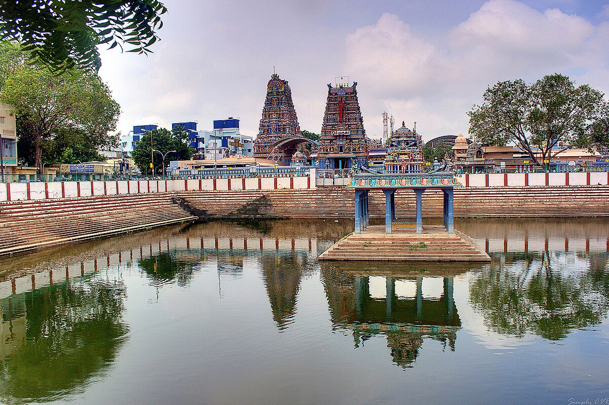

## Vadapalani Murugan Temple, Chennai

### Brief / Āmukham (आमुखम्) :
[Vadapalani Murugan Temple](https://www.astroved.com/astropedia/en/temples/south-india/vadapalani-murugan-temple) is one of the most revered and popular temples dedicated to Lord Murugan in Chennai, Tamil Nadu. 
The temple’s history dates back to the late 19th century, beginning as a humble thatched hut where Annaswami Naikar, a staunch devotee of Lord Murugan, worshipped a portrait of the deity.
The site is said to have been blessed by divine intervention, as Annaswami Naikar experienced miraculous healing and the power of prophecy (Arul Vaakku) after installing the portrait.
It is believed that worshipping here is as auspicious as [visiting the original Palani temple](https://www.holidify.com/places/chennai/vadapalani-murugan-temple-sightseeing-121149.html), making it a significant pilgrimage site for devotees from all over the world.
The temple is open daily from 5:00 AM to 12:30 PM and from 4:00 PM to 9:00 PM and days of Shasti tithi (sixth day from no moon day & new moon day) / Krithika Nakshatra  and Margazhi month temple is open from morning 4:30 AM. 

### Worship & Rituals :

- Architecture Style - The temple follows traditional [South Indian architectural style](https://www.trawell.in/tamilnadu/chennai/vadapalani-murugan-temple), featuring a towering Rajagopuram adorned with stucco figures, many depicting classical Bharatanatyam poses.
- Deites - The inner sanctum houses the main deity, Palani Andavar (Lord Murugan), along with shrines for other deities such as Ganesh, Shiva, Meenakshi Amman, Kali, Bhairava, and Dakshinamurti.
Meenakshi Amman, is usually adorned with sandal paste on Tuesdays , Fridays and on days of spritual significance.
It is a sight to behold and every devotee will be mesmerised by her divine beauty. I spend atleast a couple of minutes, and more the time I spend, I experience she coming closer to me.
Pray to her, and she will come to us and also summon Muruga to break our karmic fate and bless us with divine grace.
- My preferred worship - I always enter the temple via south entrance, pray at ganesha & circumbulate his sanctum before entering via Raja gopuram. After that, go to Kasi viwanathar shrine (Shiva) and then go to
 Shanmugha shrine (Muruga with his 2 consorts - Valli & Deivanai) , then Angaran (Planet - Mars) , Meenakshi Amman and then go past Flag mast (Kodi maram) and head towards west to enter sanctum of Palani Anadavar.
- Inner hall - sorrunding the main sanctum of Palani andavar (Muruga), houses deities of Shanmughar (Adhi - first worshipped statue at this site), Kali and Bhairavar. Bhairavar, is opposite to godess Durga and many devotees miss and go past.
 Bhairavar is the spritural guru who will accompany our souls and hence never miss his presence.
- Hanuman - Anajaneyar is opposite to main sanctum near the south end of Flag mast. I always go around him for 21 times and he has graciously showered his blessings and fulfilled my prayers.
  
- Blissful experience - The closing ceremony, known as the Palli Arai Pooja or the final puja, is my favorite part of visiting the temple. You have to purchase Rs 50/- special entrance ticket and wait besides the iron bar leading to sanctum atleast 8:30 PM.
    -  Celestial Bath: Lord Palani is given a quick celestial bath, or Abhishekam, using milk (Goshala) and rose water (Paneer).
    -  Procession: After the Arathi (waving of lights), the Lord is ceremonially taken to the Palliyarai (the ceremonial chamber), which is beautifully adorned with flowers. This marks the end of his public darshan for the day, as he retires for the night.
    -  Devotional Atmosphere: During the procession, the temple crowd chants “Arokara”, a sound that fills the space and allows for a moment of deep spiritual connection.
    -  Distribution of Prasadam: The ceremony concludes as the priest distributes the holy offering (Prasadam), typically consisting of sweet milk and ghee pepper rice with black sundal. 
 - Exit - Most devotees tend to exit via eastern entrance infront of temple tank. As per shastras, it is best to avoid exiting via this entrance.
But if you attend Paliayrai pooja, there is no option rather than exiting via this way. Even then my practical hack is to exit via East entrance , circumbalate the temple reciting the name of Muruga
and go to south entrance touch the foot stone and complete the visit.

- Trivia - The erstwhile **Hotel Saravana Bhavan** was originally started as a tea shop at this very location. It later expanded into a full-fledged hotel situated approximately 500 metres in the southern direction of the temple.
During its operation, the hotel staff actively contributed to the temple's upkeep. They sponsored the flower decorations, managed the footwear stand, and took responsibility for maintaining the temple surroundings, including regular cleaning and upkeep.

om saravana bhava. For any feedback please contact me mvignesh.appcab@gmail.com

